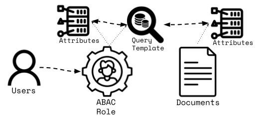

This is a continuation of the search access control topic I discussed [here](https://www.linkedin.com/pulse/role-based-access-control-elasticsearch-joey-whelan-ycznc/).  That article focused on the implementation of Role-based Access Control (RBAC) in Elasticsearch.  This article delves into document-level Attribute-based Access Control (ABAC).  In this model, users and documents possess attributes.  For a user to access a document, they must have the requisite attributes for that document.  This can be implemented in Elasticsearch via User and Document metadata and a role that implements document control via a query template.

# Architecture

## High Level
This demo is built in a simple Python notebook.  The official [Elastic Python client](https://www.elastic.co/docs/reference/elasticsearch/clients/python) is used throughout to access an [Elastic Cloud Hosted](https://www.elastic.co/cloud) (ECH) project.

 

## Security Model
The diagram below depicts how ABAC is implemented.  As discussed above, this is done via a combination of user + document attributes and a [user role](https://www.elastic.co/docs/deploy-manage/users-roles/cluster-or-deployment-auth/defining-roles) that interrogates those attributes via a [query template](https://www.elastic.co/docs/solutions/search/search-templates).



# Scenario
This demo is around a fictional nuclear reactor scenario.  There are safety and technical documents associated with the reactor that have varied departmental and training requirements for access.  There are personnel who work at the reactor who belong to departments and have completed various training programs that would entitle them to access these documents.

## Documents
The table below depicts the documents and their associated attributes.

| Document                                        | Departments                                             | Training                          |
| :---------------------------------------------  | :------------------------------------------------------ | :-------------------------------- |
|   | Reactor Operations                                      | Core Procedures, Radiation Safety |
|                  | Nuclear Materials                                       | Fuel Handling, Radiation Safety   |
|  | Reactor Operations, Nuclear Materials, Safety Oversight | Radiation Safety                  |
|        | Reactor Operations, Nuclear Materials, Safety Oversight | Core Procedures, Radiation Safety |
|        | Nuclear Materials                                       | Fuel Handling, Radiation Safety   |

## Users
The three users and their attributes are defined below.

| User                        | Department         | Training                                |
| :---------------------------| :----------------- | :-------------------------------------- |
|  | Safety Oversight   | Radiation Safety, Regulatory Compliance |
|    | Reactor Operations | Radiation Safety, Core Procedures       |
|      | Nuclear Materials  | Fuel Handling, Radiation Safety         |

## Access Matrix
Below is the resulting document access matrix based on the departmental and training requirements

| Document                                        | Users                                                                         | 
| :---------------------------------------------- | :---------------------------------------------------------------------------- | 
|   |                                                      | 
|                  |                                                        | 
|  |    | 
|        |                                                      | 
|        |                                                        | 


# Demo Steps

## Create Project 
The Python code below creates an ECH deployment via [REST API](https://www.elastic.co/docs/api/doc/elastic-cloud-serverless/operation/operation-createelasticsearchproject).  A Python Elastic client is then created to access that project.
```python
import os
from dotenv import load_dotenv
import requests
import time
from elasticsearch import Elasticsearch

load_dotenv(override=True)

payload = {
    "name": "demo-deployment",
    "region": "gcp-us-central1"
}

headers = {
    "Authorization": f"ApiKey {os.getenv("ECH_API_KEY")}",
    "Content-Type": "application/json"
}

response = requests.post(f"{os.getenv("ECH_URL")}?template_id=gcp-general-purpose", headers=headers, json=payload)
response.raise_for_status()
DEPLOYMENT_ID = response.json()["id"]
CREDENTIALS = response.json()["resources"][0]["credentials"]
CLOUD_ID = response.json()["resources"][0]["cloud_id"]

print("Awaiting deployment build")
while True:
    time.sleep(30)
    response = requests.get(f"{os.getenv("ECH_URL")}/{DEPLOYMENT_ID}", headers=headers)
    response.raise_for_status()
    es_status = response.json()["resources"]["elasticsearch"][0]["info"]["status"]
    kibana_status = response.json()["resources"]["kibana"][0]["info"]["status"]
    print(f"Elasticsearch status: {es_status}, Kibana status: {kibana_status}")
    if es_status == "started" and kibana_status == "started":
        break 
print("Deployment ready")

es = Elasticsearch(cloud_id=CLOUD_ID, basic_auth=(CREDENTIALS["username"], CREDENTIALS["password"]))
```

## Load Data
I created a small (five records) dataset for the documents and their attributes.  Below is one such record.
```json
{
  "title": "Reactor Startup Protocol", 
  "attributes": {
    "departments": ["Reactor Operations"], 
    "training": ["Core Procedures", "Radiation Safety"], 
    "min_training": 2
    }
}
```
Mapping for this data set is below.

```python
INDEX_NAME = "nuke_docs"
mappings = {
    "properties": {
        "title": {
            "type": "text"
        },
        "attributes": {
            "type": "object",
            "properties": {
                "departments": {
                    "type": "keyword"
                },
                "training": {
                    "type": "keyword"
                },
                "min_training": {
                    "type": "integer"
                }
            }
        }
    }
}
```
The code below utilizes the bulk load helper function available with the Python client.
```python
def gen_data():
    with open("assets/data.jsonl", "r") as f:
        for line in f:
            yield line.strip()
            
result = bulk(client=es, index=INDEX_NAME, actions=gen_data())
```

## Create an ABAC Role
The API call below creates a security role that includes a query template.  That template is executed every time a user with that role attempts to access a document.  The points below break down what is happening in that template:
- This is a filter query with two components: a [terms_set](https://www.elastic.co/docs/reference/query-languages/query-dsl/query-dsl-terms-set-query) and [terms](https://www.elastic.co/docs/reference/query-languages/query-dsl/query-dsl-terms-query) predicate.
- The terms_set query is doing an intersection of a given document's training requirements against the user's training.  The minimum required cardinality of the resulting set is stored in the document as 'min_training'.
- The terms query checks to see if the user's departments match at least ONE of the document's required departments.

```python
es.security.put_role(name="abac_role", body={
    "indices": [
        {
            "names": [INDEX_NAME],
            "privileges": ["read"],
            "query": {
                "template": {
                    "source": "{\"bool\": {\"filter\": [{\"terms_set\": {\"attributes.training\": {\"terms\": {{#toJson}}_user.metadata.attributes.training{{/toJson}},\"minimum_should_match_field\": \"attributes.min_training\"}}}, {\"terms\": {\"attributes.departments\": {{checks#toJson}}_user.metadata.attributes.departments{{/toJson}}}}]}}"
                }
            
            }
        }]
})
```
## Create the Users
This code creates each of the three users with their attributes (department, training) stored as metadata in their user object.
```python
es.security.put_user(
    username=booger_creds["username"],
    password=booger_creds["password"],
    roles=["abac_role"],
    metadata={
        "attributes": {
            "departments": ["Safety Oversight"],
            "training": ["Radiation Safety", "Regulatory Compliance"]
        }
    }
)

es.security.put_user(
    username=fritz_creds["username"],
    password=fritz_creds["password"],
    roles=["abac_role"],
    metadata={
        "attributes": {
            "departments": ["Reactor Operations"],
            "training": ["Core Procedures", "Radiation Safety"]
        }
    }
)

es.security.put_user(
    username=gork_creds["username"],
    password=gork_creds["password"],
    roles=["abac_role"],
    metadata={
        "attributes": {
            "departments": ["Nuclear Materials"],
            "training": ["Fuel Handling", "Radiation Safety"]
        }
    }
)
```

## ABAC Test
The code below executes match-all queries for each of the users to show which documents they can access.
```python
import json
def search_with_user(client, index_name, creds, description):
    query = {"_source":["title"],"query": {"match_all": {}}}
    response = client.options(basic_auth=(creds["username"], creds["password"])).search(index=index_name, body=query)
    print(f"\n*** {description} ***")
    results = []
    for hit in response['hits']['hits']:
        results.append(hit['_source'])
    print(json.dumps(results, indent=2))

search_with_user(es, INDEX_NAME, booger_creds, "Booger's Docs")
search_with_user(es, INDEX_NAME, fritz_creds, "Fritz's Docs")
search_with_user(es, INDEX_NAME, gork_creds, "Gork's Docs")
```
### Booger's Docs
```json
[
  {
    "title": "Radiation Safety Manual"
  }
]
```
### Fritz's Docs
```json
[
  {
    "title": "Reactor Startup Protocol"
  },
  {
    "title": "Radiation Safety Manual"
  },
  {
    "title": "Emergency Shutdown Procedures"
  }
]
```
### Gork's Docs
```json
[checks
  {
    "title": "Fuel Rod Handling Guidelines"
  },
  {
    "title": "Radiation Safety Manual"
  },
  {
    "title": "Waste Storage Protocol"
  }
]
```

## Delete Deployment
The code below deletes the Serverless project that was created in the first step.
```python
headers = {
    "Authorization": f"ApiKey {os.getenv("ECH_API_KEY")}",
    "Content-Type": "application/json"
}
response = requests.post(f"{os.getenv("ECH_URL")}/{DEPLOYMENT_ID}/_shutdown", headers=headers)
response.raise_for_status()
print(f"{response.json()['name']} is shut down")
```

# Source
https://github.com/joeywhelan/es-abac